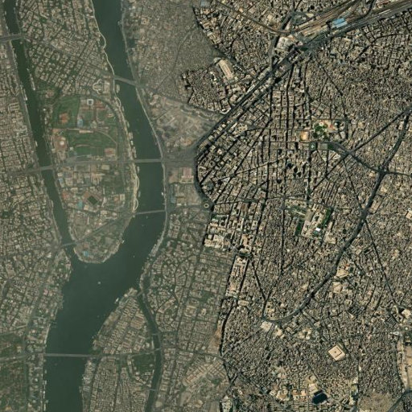
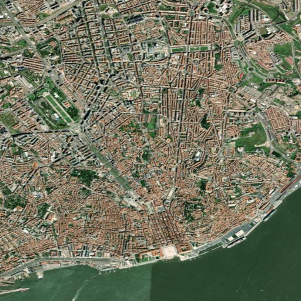
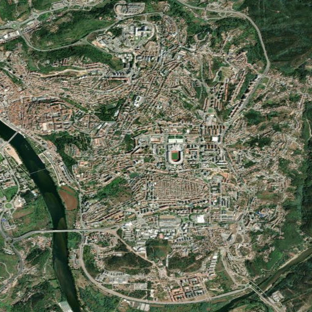

# Project Okavango - Part 2

Project Okavango is an environmental monitoring prototype developed for the Advanced Programming assignment. It combines public environmental datasets, world geospatial boundaries, ESRI World Imagery, and local Ollama models to support two related tasks:

- exploring country-level environmental indicators in an interactive dashboard
- running a first-pass AI workflow that describes satellite imagery and flags possible environmental risk

## Group N

This project was developed by:

- Margarida Rodrigues, student number 71712, 71712@novasbe.pt
- Joao Roque, student number 73047, 73047@novasbe.pt
- Nicolas Oteri, student number 71642, 71642@novasbe.pt
- Karl Harfouche, student number 70044, 70044@novasbe.pt

## Project Overview

The Streamlit application is organized into two main pages.

### 1. Environmental Dashboard

This page downloads and prepares environmental datasets from Our World in Data, merges them with Natural Earth country geometries, and allows the user to explore patterns through:

- choropleth world maps
- year filters
- top and bottom country comparisons
- summary statistics
- distribution charts
- continent-level comparisons

### 2. AI Workflow

This page allows the user to:

1. choose a location from a predefined list or enter custom coordinates
2. request ESRI World Imagery for that location
3. send the image to a local Ollama vision model for image description
4. send the description to a second local Ollama model for environmental risk assessment
5. save the result to a local CSV log for reproducibility and caching

The workflow is governed by [`models.yaml`](models.yaml), which defines the models, prompts, and generation settings used in both AI stages. This separates application logic from model configuration, making experiments easier to reproduce, compare, and audit.

## Main Features

- Interactive environmental dashboard built with Streamlit
- Automated download of OWID and Natural Earth source files
- Geospatial joins with GeoPandas
- ESRI imagery retrieval based on latitude, longitude, and zoom
- Governed two-step AI workflow using local Ollama models
- Cached workflow results based on coordinates and full model configuration
- Persistent run history saved in `database/images.csv`
- Automated tests for data download, merge logic, and AI workflow behavior

## Repository Structure

```text
app/
  ai_workflow.py         AI workflow, caching, Ollama integration, CSV logging
  okavango.py            Dataset download, loading, and geospatial merge logic
  streamlit_app.py       Main Streamlit application
database/
  images.csv             Persistent record of AI workflow runs
downloads/               Downloaded OWID datasets and Natural Earth files
images/                  Saved ESRI imagery and sample outputs
tests/                   Automated tests
models.yaml              Governed models, prompts, and settings
requirements.txt         Python dependencies
README.md                Project documentation
```

## Requirements

For the core dashboard and tests:

- Conda installed locally
- Python 3.10 or newer
- Internet access for the initial dataset download

For the AI workflow:

- Ollama installed locally
- Ollama running on the local machine
- Internet access the first time Ollama pulls a model
- Enough RAM / compute to run the models defined in `models.yaml`

## Recommended Setup With Conda

The project was prepared and tested with Windows PowerShell. The commands below use `conda` and are written for a typical Windows setup.

### 1. Clone the repository

```powershell
git clone <your-repository-url>
cd AdPro_Assigment_Group_N
```

### 2. Create a Conda environment

```powershell
conda create -n okavango python=3.10 -y
```

### 3. Activate the environment

```powershell
conda activate okavango
```

### 4. Install the project dependencies

```powershell
python -m pip install --upgrade pip
pip install -r requirements.txt
```

If `conda activate` does not work in PowerShell, initialize Conda first and restart the terminal:

```powershell
conda init powershell
```

## Ollama Setup For The AI Workflow

Install Ollama from:

<https://ollama.com/download>

After installation, make sure the Ollama application or background service is running before starting the Streamlit app.

By default, the project expects Ollama at:

```text
http://127.0.0.1:11434
```

If your Ollama server is running elsewhere, set one of the following environment variables before launching the app:

```powershell
$env:OLLAMA_BASE_URL="http://127.0.0.1:11434"
```

or

```powershell
$env:OLLAMA_HOST="127.0.0.1:11434"
```

The code automatically checks whether the configured Ollama endpoint is reachable and will try to pull missing models when needed. Because the project uses local Ollama models, no external cloud API key is required.

## AI Configuration

The file [`models.yaml`](models.yaml) controls the full AI workflow. It currently defines:

- an image-analysis model: `llava:7b`
- a text-analysis model: `llama3.2:3b`
- the prompt template used for image description
- the prompt template used for structured risk assessment
- generation settings such as `temperature`
- image settings such as `image_size`

This design improves reproducibility because each saved run is tied to a configuration fingerprint and cache key derived from the selected coordinates, zoom level, prompts, models, and settings.

## How To Run The App

From the project root, with the Conda environment activated:

```powershell
streamlit run app\streamlit_app.py
```

You can also use:

```powershell
python -m streamlit run app\streamlit_app.py
```

Then open the local Streamlit URL shown in the terminal, usually:

```text
http://localhost:8501
```

## How The Dashboard Works

When the user opens the `Environmental dashboard` page, the app:

1. downloads the configured OWID datasets if they are not already present
2. downloads and extracts the Natural Earth world map if needed
3. loads the datasets into pandas DataFrames
4. merges them with the world geometry using ISO3 codes
5. allows exploration of environmental metrics by year and country

The current dashboard datasets include:

- annual change in forest area
- annual deforestation
- share of protected land
- share of degraded land
- forest area as share of land area

## How The AI Workflow Works

When the user opens the `AI workflow` page, the app:

1. lets you choose a built-in city or input custom coordinates
2. lets you choose a zoom level
3. downloads ESRI satellite imagery for that area
4. describes the image with the configured Ollama vision model
5. asks a second model to return a structured JSON risk assessment
6. stores the full result in `database/images.csv`
7. reuses a previous result if the coordinates and governed settings match an existing cached run

Each workflow result includes:

- selected coordinates and zoom
- generated image path
- image description
- risk level
- risk score
- evidence bullets
- follow-up questions
- raw model output

## Generated Files And Persistent Data

During normal use, the project may create or update the following folders:

- `downloads/` for OWID CSV files and Natural Earth shapefiles
- `images/` for ESRI image downloads
- `database/images.csv` for stored workflow results

These files are part of the normal project workflow. In particular, `database/images.csv` serves both as a persistent execution log and as the source used to recover cached AI workflow results.

## Running The Tests

With the Conda environment activated, run:

```powershell
pytest -q
```

or:

```powershell
python -m pytest -q
```

The automated tests cover core behavior such as:

- dataset download logic
- world map and dataset merging
- governed AI configuration loading
- workflow caching behavior
- structured AI output handling

## Example Workflow Outputs

Below are saved examples from the AI workflow. These are prototype outputs and should not be treated as validated environmental assessments.

### Example 1: Cairo, Egypt



- Coordinates: `30.0444, 31.2357`
- Zoom: `14`
- Risk result: `high` with score `90`
- Flagged: `Y`

### Example 2: Lisbon, Portugal



- Coordinates: `38.7223, -9.1393`
- Zoom: `14`
- Risk result: `high` with score `92`
- Flagged: `Y`

### Example 3: Coimbra, Portugal



- Coordinates: `40.2033, -8.4103`
- Zoom: `14`
- Risk result: `medium` with score `68`
- Flagged: `Y`

## Why This Project Matters

Project Okavango is a prototype, but it demonstrates how public environmental data and local AI tooling can be combined into a practical monitoring workflow. It is especially relevant to:

- SDG 13: Climate Action
- SDG 15: Life on Land
- SDG 11: Sustainable Cities and Communities
- SDG 6: Clean Water and Sanitation

It does not replace expert assessment. Instead, it helps users move more quickly from raw data and imagery to an initial signal that can then be reviewed by a human analyst.

## Troubleshooting

- If `conda activate okavango` fails, run `conda init powershell`, restart PowerShell, and try again.
- If Streamlit does not start, confirm the Conda environment is active and the dependencies from `requirements.txt` were installed successfully.
- If GeoPandas installation fails, recreate the Conda environment and reinstall the dependencies in a clean environment.
- If the dashboard fails on first run, check your internet connection because the source datasets and world map may still need to be downloaded.
- If the AI workflow fails immediately, confirm Ollama is installed, running, and reachable at the configured `OLLAMA_BASE_URL` or `OLLAMA_HOST`.
- If a model call fails during generation, the machine may not have enough resources for the configured model.
- If the workflow appears to repeat old results, check `database/images.csv`; the app intentionally reuses cached results when the same coordinates, zoom, and governed settings are selected.

## Notes

- This is a proof-of-concept academic project.
- The first run is slower because datasets and models may need to be downloaded.
- AI outputs may vary depending on the exact local model versions and hardware available.
- Reproducibility is improved through `models.yaml`, but it is still constrained by local environment differences.
