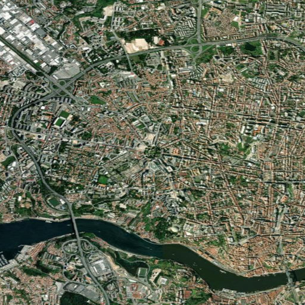

# Project Okavango - Part 2

Project Okavango is a lightweight environmental monitoring prototype built for the Advanced Programming assignment. It combines recent Our World in Data datasets, geospatial country maps, ESRI World Imagery, and local Ollama models to help analysts screen areas that may be under environmental stress.

## Group N

This project was developed by:

- Margarida Rodrigues, student number 71712, 71712@novasbe.pt
- Joao Roque, student number 73047, 73047@novasbe.pt
- Nicolas Oteri, student number 71642, 71642@novasbe.pt
- Karl Harfouche, student number 70044, 70044@novasbe.pt

## What The App Does

The Streamlit app has two pages:

1. Environmental dashboard
   Loads recent environmental datasets, joins them with world geometry, and lets the user explore country-level patterns through maps, charts, filters, and comparisons.
2. AI workflow
   Lets the user choose latitude, longitude, and zoom, download a matching ESRI World Imagery image, describe that image with a local vision model in Ollama, and then assess whether the area appears to be at environmental risk using a second local language model.

The AI workflow is governed by `models.yaml` and every run is logged in `database/images.csv`. If the same coordinates, zoom, and governed settings were already used before, the app reuses the cached image and stored results instead of running the pipeline again.

## Repository Structure

```text
app/
  ai_workflow.py         AI pipeline, caching, database logging, ESRI image download
  okavango.py            Dataset download and processing logic
  streamlit_app.py       Main Streamlit application
database/
  images.csv             Persistent log of AI workflow runs
images/                  Saved ESRI imagery and example outputs
models.yaml              Governed Ollama models, prompts, and settings
requirements.txt         Python dependencies
tests/                   Automated tests
```

## Installation

The project was prepared for Python 3.10+ on Windows, but it should also work on other systems with the equivalent commands.

1. Clone the repository.
2. Open a terminal in the project root.
3. Create and activate a virtual environment.
4. Install Python dependencies.
5. Install and start Ollama.

### Python Setup

```powershell
python -m venv .venv
.venv\Scripts\Activate.ps1
python -m pip install --upgrade pip
python -m pip install -r requirements.txt
```

### Ollama Setup

Install Ollama from: <https://ollama.com/download>

After installing it, make sure the Ollama application or service is running locally. By default, the app expects:

```text
http://127.0.0.1:11434
```

If your Ollama server is running elsewhere, set one of these environment variables before starting the app:

```powershell
$env:OLLAMA_BASE_URL="http://127.0.0.1:11434"
```

or

```powershell
$env:OLLAMA_HOST="127.0.0.1:11434"
```

The app will automatically pull missing models the first time they are needed.

## How To Run

Run the Streamlit app with:

```powershell
python -m streamlit run app\streamlit_app.py
```
```powershell
py -m streamlit run app\streamlit_app.py
```

Then open the local Streamlit URL shown in the terminal.

## How To Use The AI Workflow

1. Open the `AI workflow` page from the sidebar.
2. Choose a location either from the built-in country/city list or by entering custom coordinates.
3. Select a zoom level.
4. Click `Run AI workflow`.

The app will then:

1. Download an ESRI World Imagery image into `images/`.
2. Read the governed model and prompt settings from `models.yaml`.
3. Generate an image description with the configured vision model.
4. Ask a second model to assess environmental risk from that description.
5. Show the image, description, risk badge, evidence, and follow-up questions.
6. Append the full result to `database/images.csv`.
7. Reuse a cached result later if the same settings are selected again.

## Governed AI Configuration

The file `models.yaml` stores:

- The image-analysis model
- The image-analysis prompt
- Image settings such as temperature and image size
- The text-analysis model
- The text-analysis prompt
- Text-generation settings

This keeps the workflow reproducible and makes it possible to explain which exact prompts and models produced each logged result.

## Verification

You can verify that the project is set up correctly by running the test suite from the project root.

On most systems, either of the following commands will work:

```powershell
python -m pytest -q
```
```powershell
py -m pytest -q
```

## Example Environmental Risk Detections

Below are three saved examples from the app's AI workflow. These examples were already generated by the application and logged in `database/images.csv`.

### Example 1: Cairo, Egypt


- Coordinates: `30.0444, 31.2357`
- Zoom: `14`
- Risk result: `high` with score `90`
- Flagged: `Y`
- Summary: Visible signs of deforestation, urbanization, and water bodies suggest a high level of environmental concern.

### Example 2: Lisbon, Portugal


- Coordinates: `38.7223, -9.1393`
- Zoom: `14`
- Risk result: `high` with score `92`
- Flagged: `Y`
- Summary: Visible signs of deforestation, land degradation, and urban encroachment.

### Example 3: Porto, Portugal



- Coordinates: `41.1579, -8.6291`
- Zoom: `14`
- Risk result: `high` with score `92`
- Flagged: `Y`
- Summary: Visible signs of deforestation, land degradation, and wildfire scars indicate a high level of environmental stress.

## Why This Project Can Help The UN SDGs

Project Okavango is a prototype, but it shows how low-cost data tools and local AI workflows can support environmental monitoring in a practical way. By combining recent public datasets with satellite imagery, the app can help users quickly identify patterns that deserve deeper investigation. It does not replace expert analysis, but it can reduce the time needed to move from raw data to a first environmental risk signal.

The project is especially connected to these Sustainable Development Goals:

- SDG 13: Climate Action
  The app helps identify visible land stress, degradation, wildfire scars, and possible climate-related impacts that may require intervention.
- SDG 15: Life on Land
  The workflow is directly aimed at detecting issues such as deforestation, habitat fragmentation, and land degradation.
- SDG 11: Sustainable Cities and Communities
  Urban encroachment and land-cover pressure near settlements can be screened visually, helping understand where development may be harming surrounding ecosystems.
- SDG 6: Clean Water and Sanitation
  Because the image analysis also considers water bodies and possible flooding or drought cues, the tool can contribute to early screening of areas where water systems may be under pressure.

In practice, a tool like this could help NGOs, municipalities, researchers, or student teams prioritize where to look next. Instead of manually checking large numbers of locations one by one, they can use a reproducible workflow to flag suspicious areas, document model decisions, and then focus human attention on the places that most need validation.

## Notes

- The app is a proof of concept, so model outputs may vary depending on machine performance and available memory.
- The first Ollama run may take longer because models may need to be downloaded.
- The AI workflow uses free tools and public imagery, so the goal is technical functionality and reproducibility rather than perfect environmental diagnosis.
